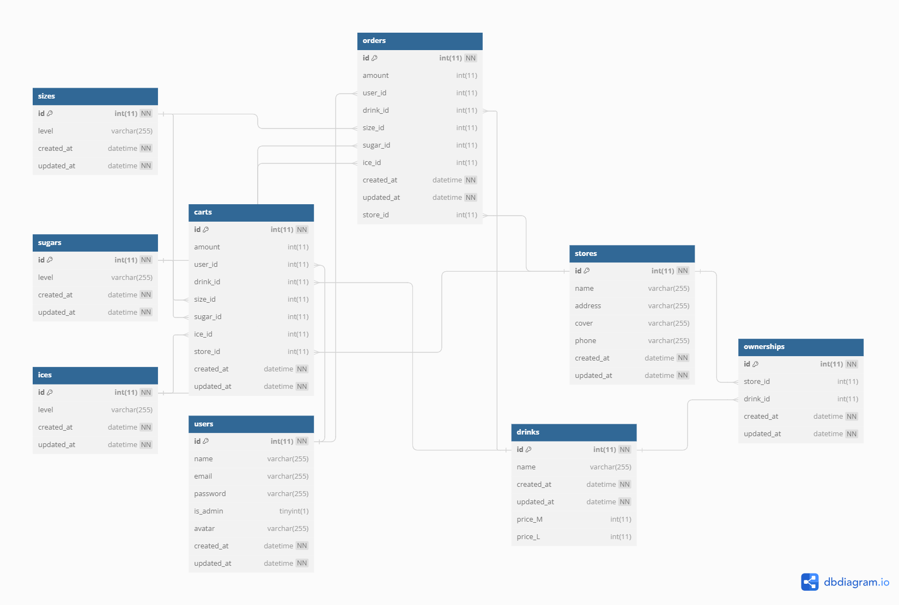

# Ordering-drinks

## 介紹
+ 這是一個簡易的揪團訂飲料系統
+ 使用者可從指定店家填選想喝的飲料, 告訴主揪想喝什麼飲料
+ 正式下訂時系統可自動寄發訂單訊息給使用者信箱
+ 拿飲料的時候, 可從手機信箱查看訂單內容, 避免忘記
+ 本專案亦具備 web API 的形式, 經取得 token 後可進行操作

### 功能
+ 具有使用者驗證管理系統, 實作登入、登出功能
+ 為簡化註冊流程, 提升安全性, 亦提供第三方 OAuth 之 Google 登入功能
+ 可針對店家及飲品資料, 進行建立、查看、編輯、刪除等資料操作
+ 提供搜尋功能、動態頁碼, 可切換顯示全部或分頁顯示
+ 可上傳圖片, 包括使用者頭像、店家封面照片

### 頁面介紹
+ **首頁:** 可瀏覽所有店家, 並點選單一店家頁面
+ **單一店家頁面:** 可指定要購買的飲料, 需選擇飲料、杯型、甜度、冰量、杯數
+ **查看購物車頁面:** 確認自己購買的品項與規格, 並自動結算總金額; 可移除不要的品項, 或正式下訂讓主揪知道要幫買的飲料
+ **購買記錄頁面:** 可查看購買紀錄, 可搜尋店家、飲料名稱、購買時間, 但前台不可移除購買紀錄; 依時間搭配搜尋功能可以查看指定年度、指定月份、指定日期所購買的飲料(按時間呈現格式輸入)
+ **具 Admin 權限者:** 可從後台頁面管理所有店家、使用者、購買紀錄(含移除)
+ **後台店家:** 可從後台上架或下架店家的飲品資訊, 供前台陳列可購買的飲品

## 資料庫設計

| 資料表  | users    | stores    |   drinks   |  ownerships             | orders | carts | seizes| sugars | ices   |
| ----- | --------- | ---------- |   ------ |  ----------------------- | ----- | ------ | ------| ------ | ----- |
| 說明  | 使用者     | 店家      |   商品    |   店家與飲料的關聯  | 訂單  | 購物車 | 杯型   | 甜度    | 冰量  |

+ 每筆購物車對應一種杯型、甜度、冰量 
+ 每筆訂單亦對應一種杯型、甜度、冰量 
+ 每位使用者可添加多筆購物車及訂單 
+ 每種飲料可出現在多筆購物車及訂單 
+ 每間店家可販售多種飲料 
+ 每種飲料亦可被多間店家販售 

## 開始使用
+ 請在本機安裝 Node.js 與 npm 套件管理系統
+ 本專案採用 Node.js v14.16.0 進行開發, 請確認版本的一致性
+ 複製專案到本機: Bash 指令 git clone https://github.com/your-username/sp-ordering-drinks-061624.git
+ 進入專案資料夾: Bash 指令 cd sp-ordering-drinks-061624
+ 安裝套件: Bash 指令 npm install
+ 確認套件齊全(可參考下方開發工具)
+ 建立.env檔案並填入相關資料(可參考.env example檔案)
+ 設定MySQL資料庫: username、password、database 與專案 config/config.json 中的 development 相同
+ 建立資料庫資料表: Bash 指令 npx sequelize db:migrate
+ 建立種子資料: Bash 指令 npx sequelize db:seed:all
+ 啟動專案: Bash 指令 npm run start; 或使用 nodemon 進行開發, Bash 指令 npm run dev
+ 看到以下訊息，可至瀏覽器輸入下列網址開啟 Ordering drinks application listening on port: http://localhost:3002

## 測試帳號
| 使用者類型      | email              | password   |
| -------------- | ------------------ | ---------- |
| 管理員使用者    | root@example.com   | 12345678   |
| 使用者 1 號     | user1@example.com  | 12345678   |
| 使用者 2 號     | user2@example.com  | 12345678   |

## Web APIs 路由設計
點擊[ Web APIs ](https://scarlet-page-533.notion.site/1130612-Ordering-drinks-Web-APIs-beb80ee919da461a9ee6021fe2fc7bf4)查看使用範例

本專案同時以 Web APIs 提供服務, 依循 RESTful API 理念設計路由。 將 email、password 發送到本站的 signin 路由, 即可得到 Auth Type 為 Bearer Token 的憑證, 夾帶憑證即可使用本站 Web APIs, 路由對應功能簡述如下

### 與 User 有關的路由
+ POST /api/signup 註冊
+ POST /api/signin 登入
+ GET /api/users/:id 瀏覽指定使用者頁面
+ GET /api/users/:id/edit 瀏覽指定使用者編輯頁面
+ PUT /api/users/:id 編輯指定使用者
+ PUT /api/avatars/:userId 移除指定使用者頭像
+ GET /api/carts 瀏覽複數購物車頁面
+ POST /api/carts/:storeId 新增購物車之指定商店
+ DEL /api/carts/:cartId 移除指定購物車
+ GET /api/orders 瀏覽複數訂單頁面
+ POST /api/orders/all 新增複數訂單並清空購物車

### 與 Store 有關的路由
+ GET /api/stores 瀏覽複數飲料店頁面
+ GET /api/stores/:id 瀏覽指定飲料店頁面

### 與 Admin 有關的路由
+ GET /api/admin/stores 在後台瀏覽複數案場頁面
+ POST /api/admin/stores 在後台新增案場
+ GET /api/admin/stores/:id 在後台瀏覽指定案場頁面
+ PUT /api/admin/stores/:id 在後台編輯指定案場
+ DEL /api/admin/stores/:id 在後台移除指定案場
+ POST /api/admin/ownership/:drinkId 在後台上架飲料品項
+ DEL /api/admin/ownership/:drinkId 在後台下架飲料品項
+ GET /api/admin/users 在後台瀏覽複數使用者頁面
+ PATCH /api/admin/users 在後台修改使定使用者
+ GET /api/admin/orders 在後台瀏覽複數訂單頁面
+ DEL /api/admin/orders/:orerId 在後台移除指定訂單

## 主要技術
- [Nodemailer](https://nodemailer.com/)
- [Google OAuth 2.0](https://developers.google.com/?hl=zh-tw)
- [MySQL](https://www.mysql.com/)
- [Sequelize](https://sequelize.org/)
- [Handlebars](https://handlebarsjs.com/)
- [Express](https://expressjs.com/)
- [Node.js](https://nodejs.org/)

## 開發工具
+ axios: 1.7.2
+ bcryptjs: 2.4.3
+ connect-flash: 0.1.1
+ dayjs: 1.10.6
+ dotenv: 10.0.0
+ express: 4.17.1
+ express-handlebars: 5.3.3
+ express-session: 1.17.2
+ jsonwebtoken: 8.5.1
+ method-override: 3.0.0
+ moment-timezone: 0.5.45
+ multer: 1.4.3
+ mysql2: 2.3.0
+ nodemailer: 6.9.14
+ passport: 0.4.1
+ passport-facebook: 3.0.0
+ passport-google-oauth20: 2.0.0
+ passport-jwt: 4.0.0
+ passport-local: 1.0.0
+ sequelize: 6.6.5
+ sequelize-cli: 6.2.0

